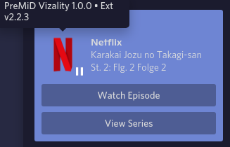

# PreMiD for Vizality

Based on [MulverineX/premid-powercord](https://github.com/MulverineX/premid-powercord).

Connects to your browser's PreMiD extension without the need of installing and running the external bloated electron tray process for an overweight IPC-Websocket bridge. You can't run both the official PreMiD application and the plugin!
  
Based on code from the PreMiD app & premid-powercord